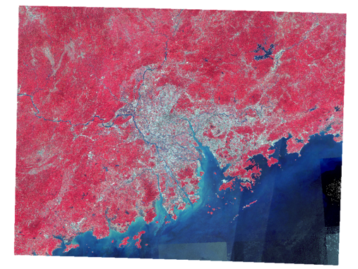
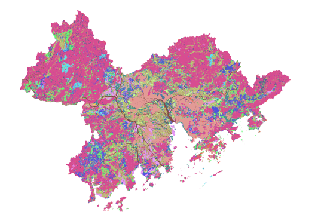
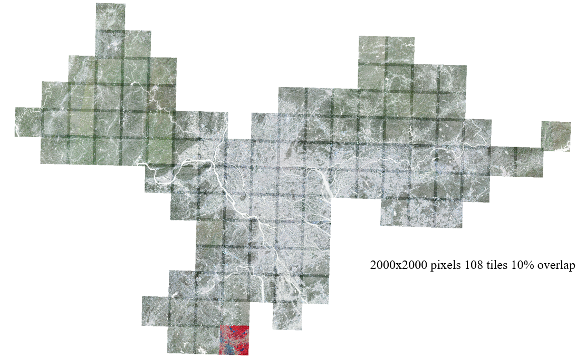
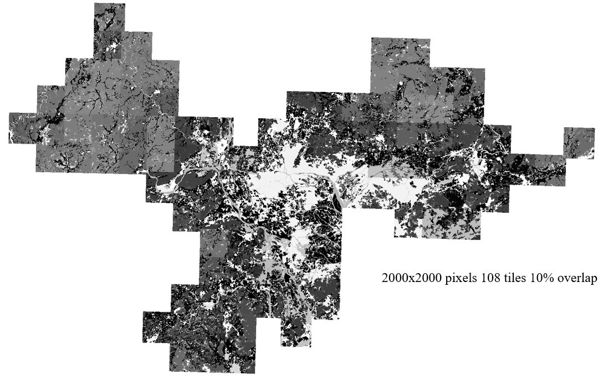
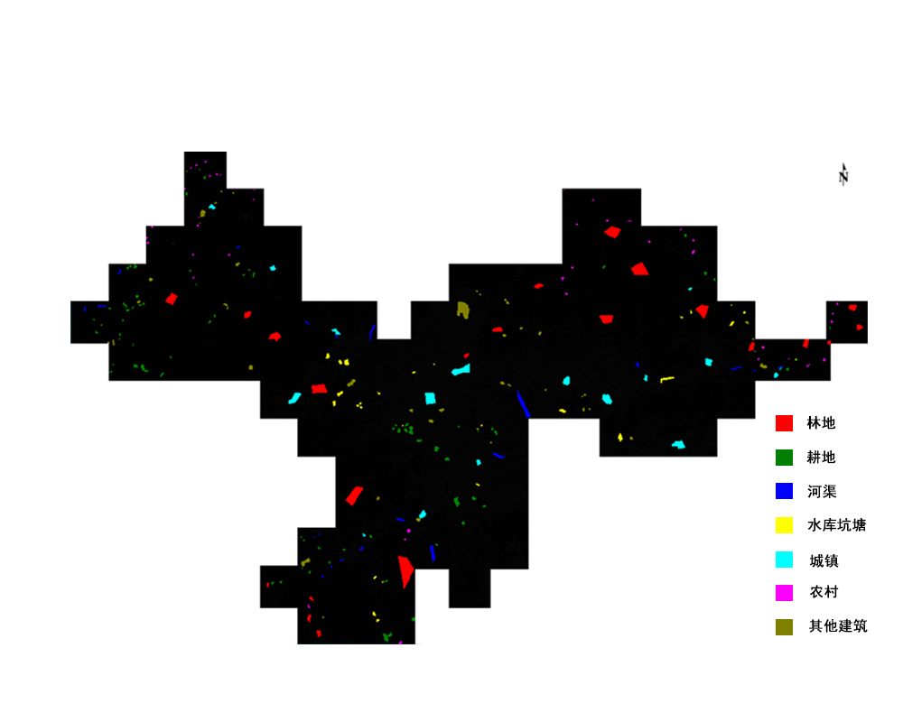
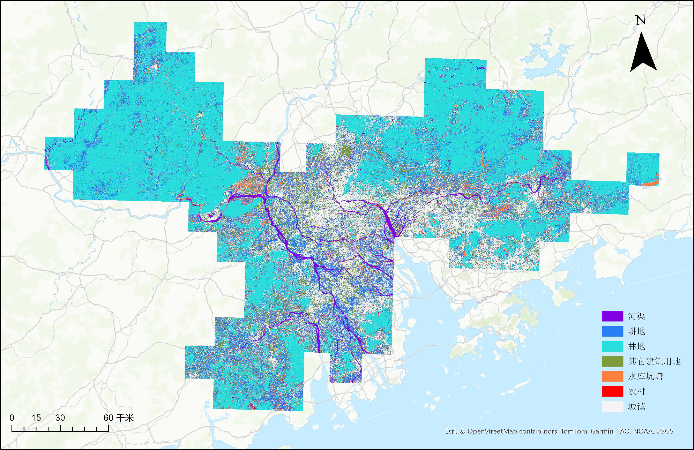
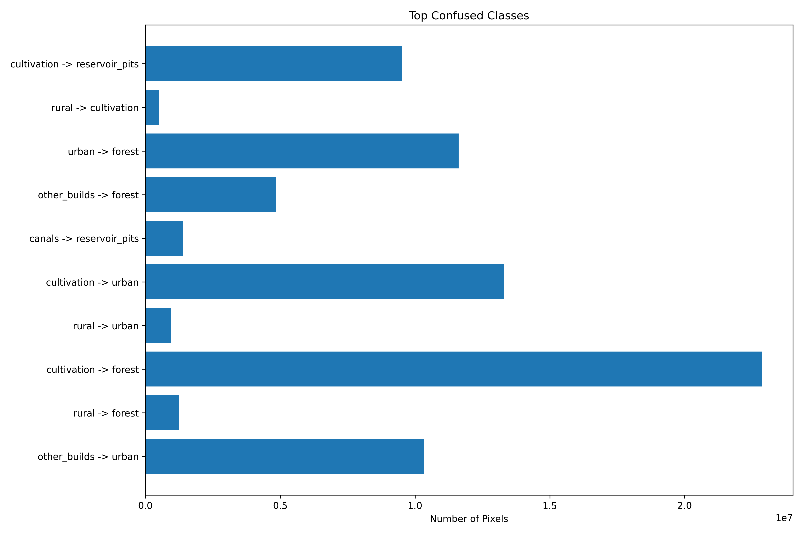
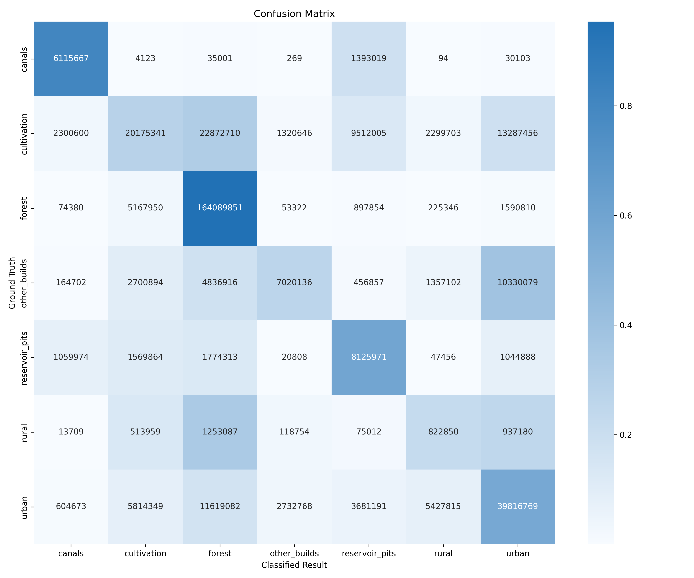

# sseg4rs
Semantic segmentation tasks (both fully and weakly supervised) using your own remote sensing datasets

## Fully Supervision Semantic Segment

code from https://github.com/WangLibo1995/GeoSeg

**How to prepare your own dataset using model of GeoSeg**

- mkdir folder of your dataset to configure parameters in *config* folder named after the model you want to use(e.g. *ftunetformer.py*)
- mkdir folder to load your dataset in *geoseg/dataset* folder(reference to other official public dataset, e.g. *bigbay.py* in this case)

**How to train**

- optimize super-parameters by train_optuna.py

  `python train_optuna.py -c config/bigbay/ftunetformer.py --use_optuna --optuna_trials 20 --optuna_epochs 5 --visualize_optuna --use_wandb --save_optuna_checkpoints --wandb_project "your_project_name" --wandb_entity "your_entity"`

- run train.py using super-parameters outputted by train_optuna.py

  `python train.py -c config/bigbay/ftunetformer.py --use_wandb --wandb_project "your_project_name"`

**How to test**

write test script for your dataset reference other official dataset and run test.py

`python bigbay_test.py -c config/bigbay/ftunetformer.py -o your_output_path --rgb`

## Weakly Supervision Semantic Segment

code from https://github.com/LiZhuoHong/Paraformer

**How to prepare your dataset**

just use *clip_v7.py* script in tools folder and set correct paths in your code

- add *dataset_config* in *train.py* & *test.py*, make sure your path and number of classes is correct(if you have no idea of classes number in your dataset, run *uniqueValue.py* )
- modify means and stds value based on your dataset(run *means_stds.py*) in *utils.py*

**How to train**

run *train.py* and set proper parameters

`python train.py --dataset BigBay --batch_size 16 --base_lr 0.01 --max_epochs 100 --savepath ./checkpoints/BigBay/ --gpu 0 --no_wandb`

**How to test**

run *test.py*

`python test.py --dataset BigBay --model_path save\model\epoch_99.pth --save_path save/prediction --gpu 0`

**How to evaluate accuracy**

see *assessmentv1.py* after you got **Ground Truth**

## Scripts in Tools

- ***clip_v7.py***

  clip by your valid label region

    
    

`Example usage(more details see --help):`

1. `Single mode (clip single image):`

  `python scripts\clips_v7.py --src_path BigBayDataset\landsat8\ld2015_rgb.tif --output_dir BigBayDataset\landsat8\clips --single_mode --img_nodata 0,0,0 --tile_size 1024`

2. `Dual mode (clip label and image by valid label region):`

  `python scripts\clips_v7.py --label_path BigBayDataset\lucc\ld2010.tif --src_path BigBayDataset\landsat8\BigBay_L5T1L2_RGB_2010_prj.tif --output_dir E:\2025\test\2010 --tile_size 1024 --suffix 2010`

    
    

- ***rfc.py***

  random forest for mega-rs images(10GB)

    
    

run main() and scripts will output assessment html file, classified image, model and feature importance figure

    

- ***assessmentv1.py***

  assess accuracy(more details see --help argument)

  set your gt classname map in row 769 like:

  `gt_classnames = {0: "canals",1: "cultivation",2: "forest",3: "other_builds",4: "reservoir_pits",5: "rural",6: "urban"}`

  set your model prediction classname map like:

  ​    `result_classnames = {1:"forest",4:"canals",6:"reservoir_pits",9:"urban",10:"rural",11:"other_builds"}`

  run script in command line like:

  `python scripts\assessment_v1.py --gt_path rfc\ground_truth.tif --cls_res_path predict\model_prd.tif --output_dir assessment_results`

  what we will get:

  - assessment summary report(.txt)
- confused classes(.png)
  - confusion matrix(.png)
- error map(.tif)

        

- ***other scripts***

  just try
